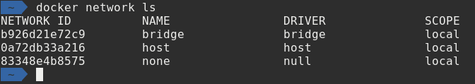

# Diving into Docker

---

## Andrew Pruski

### Field Solutions Architect
#### Microsoft Data Platform MVP
#### Docker Captain
#### VMware vExpert

<!-- .slide: style="text-align: left;"> -->
<i class="fab fa-twitter"></i><a href="https://twitter.com/dbafromthecold">  @dbafromthecold</a> 
<i class="fas fa-envelope"></i>  dbafromthecold@gmail.com 
<i class="fab fa-wordpress"></i>  www.dbafromthecold.com 
<i class="fab fa-github"></i><a href="https://github.com/dbafromthecold">  github.com/dbafromthecold</a>

---

## Session Aim
<!-- .slide: style="text-align: left;"> -->
To provide a deeper knowledge of the Docker platform - UPDATE!

---

## Why databases in Docker?

<!-- .slide: style="text-align: left;"> -->
- Ease of deployment
- Known configuration
- Testing new versions (rollback)
- Separate compute from data

---

## Agenda
<!-- .slide: style="text-align: left;"> -->
- Isolation 
- Networking 
- Persisting data 
- Custom images 
- Docker Compose 

---

# Isolation

---

## Container Isolation
<!-- .slide: style="text-align: left;"> -->
"Containers isolate software from its environment and ensure that it works uniformly despite differences for instance between development and staging" 
<a href="https://www.docker.com/resources/what-container">docker.com/resources/what-container</a>

---

## Control Groups
<!-- .slide: style="text-align: left;"> -->
Ensures a single container cannot consume all 
resources of the host 
 
Implements resource limiting of:-
- CPU
- Memory

---

## Namespaces
<!-- .slide: style="text-align: left;"> -->
Control what a container can see 
 
Used to control:- 
- Hostname within the container
- Processes that the container can see
- Mapping users in the container to users on the host

---

## File system
<!-- .slide: style="text-align: left;"> -->
- Containers cannot see the entire host's filesystem 
- They can only see a subset of that filesystem 
- The container root directory is changed

---

# Demo

---

# Networking

---

## Default networks
<!-- .slide: style="text-align: left;"> -->

- bridge 
- host 
- none 

---

## Bridge network
<!-- .slide: style="text-align: left;"> -->
- Default network 
- Represents _docker0_ network 
- Containers communicate by IP address 
- Supports port mapping 

---

## User defined networks
<!-- .slide: style="text-align: left;"> -->
- Docker provide multiple drivers 
- DNS resolution of container names to IP addresses 
- Can be connected to more than one network 
- Connect/disconnect from networks without restarting 

---

# Demo

---

# Persisting data

---

## Options for persisting data
<!-- .slide: style="text-align: left;"> -->
- Bind mounts 
- Data volume containers 
- Named volumes

---

# Demo

---

## Resources
<!-- .slide: style="text-align: left;"> -->

<a href="https://github.com/dbafromthecold/DockerAndDatabases">https://github.com/dbafromthecold/DockerAndDatabases</a> 

  

